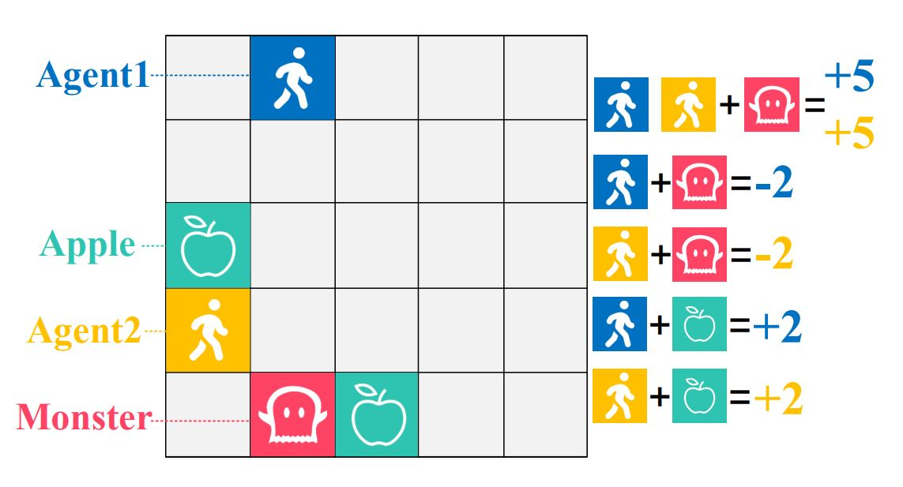
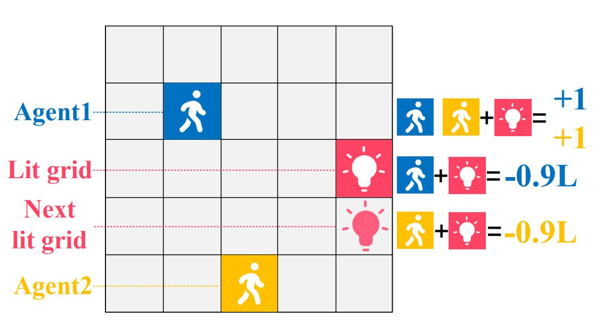

## Environments supported:

- Matrix Game (MG)

  - [StagHunt](https://en.wikipedia.org/wiki/Stag_hunt)
  - [PrisonerDilemma](https://en.wikipedia.org/wiki/Prisoner%27s_dilemma)
  - [Chicken](https://en.wikipedia.org/wiki/Chicken_(game))

- Grid World (GW)

  - Monster-Hunt

    <div align=center> </div>

    In Monster-Hunt, there is a monster and two apples. The monster keeps moving towards its closest agent while apples are static. When a single agent meets the monster, it **losses** a penalty of 2; if two agents catch the monster at the same time, they both earn a bonus of 5. Eating an apple always gives an agent a bonus of 2. Whenever an apple is eaten or the monster meets an agent, the apple or the monster will respawn randomly. The monster may move over the apple during the chase, in this case, the agent will gain the sum of points if it catches the monster and the apple exactly.

  - Escalation

    <div align=center> </div>
  
    In Escalation, two agents appear randomly and one grid lights up at the initialization. If two agents step on the lit grid simultaneously, each agent can gain 1 point, and the lit grid will go out with an adjacent grid lighting up. Both agents can gain 1 point again if they step on the next lit grid together. But if one agent steps off the path, the other agent will *lose* 0.9L points, where L is the current length of stepping together, and the game is over. Another option is that two agents choose to step off the path simultaneously, neither agent will be punished, and the game continues.

The Monster-Hunt and Escalation tasks are implemented according to the Markov Stag-hunt and Coordinated Escalation tasks, which are proposed in the paper "Prosocial learning agents solve generalized Stag Hunts better than selfish ones" [(https://arxiv.org/abs/1709.02865)](https://arxiv.org/abs/1709.02865) for the first time. 

## Usage

- The algorithm/ subfolder contains algorithm-specific code for PPO (Proximal Policy Optimization), which is heavily based on https://github.com/ikostrikov/pytorch-a2c-ppo-acktr-gail.

- The envs/ subfolder contains environment wrapper implementations for the Matrix Game and Grid World.

- Executable scripts for training with default hyperparameters can be found in the scripts/ folder. The files are named in the following manner: xxx.sh. 
  - Python training scripts for each environment can be found in the scripts/train/ folder.
  - Python evaling scripts for each environment can be found in the scripts/eval/ folder.

- The config.py file contains relevant hyperparameter and env settings. Most hyperparameters are defaulted to the ones used in the paper; however, please refer to the appendix for a full list of hyperparameters used.

## 3.Train

Here we use train_GW.sh as an example:

  ```
  cd scripts
  chmod +x ./train_GW.sh
  ./train_GW.sh
  ```

Local results are stored in subfold scripts/results.
